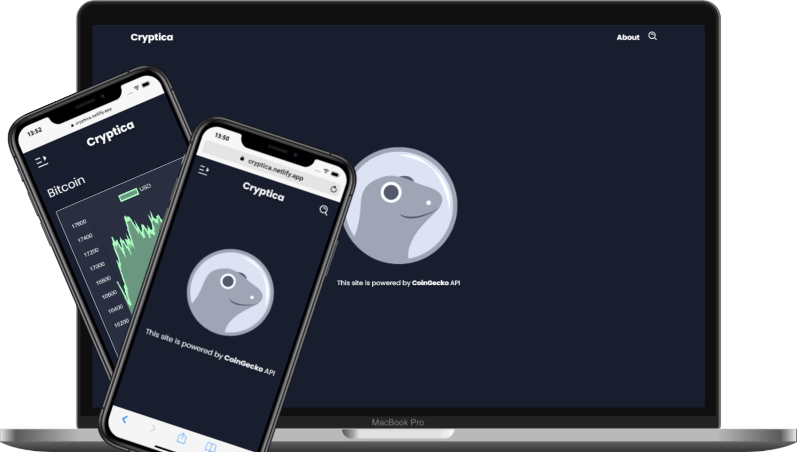

# Cryptica

Is a cryptocurrency web tracker focused on mobile devices oriented to deliver a fluent interaction with cryptocurrencies most recent markets values

**The app is available right away using the link provided below:**

[Click me! ⚡](https://cryptica.netlify.app)

## About

Cryptica is a real world React-Redux application developed for assestment processes at [Microverse]() using industry standards

The app prototype was designed in [Figma]() and is also available in the documentation folder

This app is powered by the [CoinGecko-API]()

### Getting started

This is an open source project and you can get a local copy of it

Install the required dependencies:

    - node.js
    - npm or yarn

Run:

    - sudo yarn install or sudo npm install

### Usage

    - yarn start or npm run start

### Run tests

    - yarn test or npm run test

### Authorship and fair use

This application was designed and developed for me and, you are free to make fair use of it

If you make use of this project or its components it's kind of you to mention me or credit it to me :D

- Github: [@leonmezu1](https://github.com/leonmezu1)
- Twitter: [@leonmezu](https://twitter.com/leonmezu)
- Linkedin: [Leonardo Mezu](https://www.linkedin.com/in/leonardomezlob/)

### Contributing

Contributions, issues and feature requests are welcome!
Feel free to check the [issues page](../../issues/).

### Show support

Liked this project? star it!

### Acknowledgments

This project was bootstrapped with [Create React App](https://github.com/facebook/create-react-app).

### License

This project is [MIT](./LICENSE) licensed